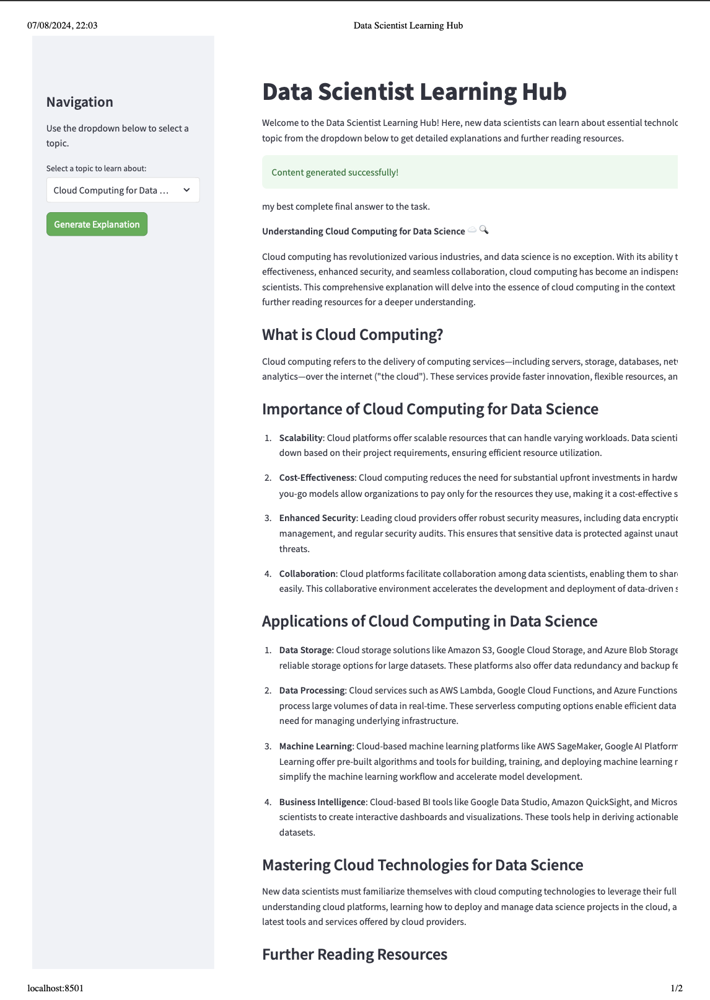
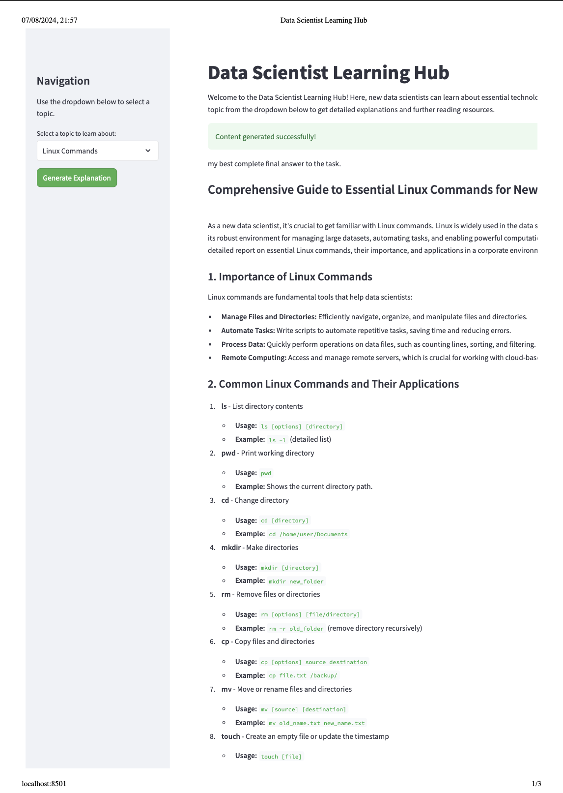
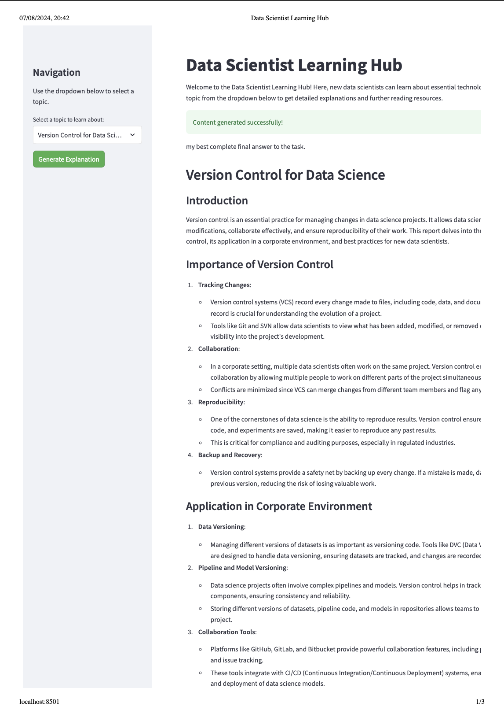
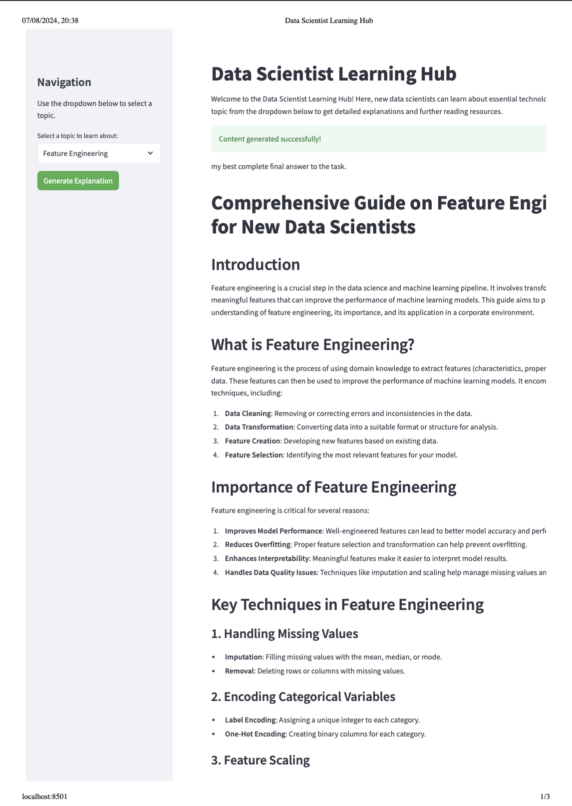

# Data Scientist Learning Hub Using Multi Agents 🕵🏻

Welcome to the Data Scientist Learning Hub! This project is designed to help new data scientists learn about essential technologies and processes through a user-friendly Streamlit app using agents.

## Overview 

The Data Scientist Learning Hub provides detailed explanations and further reading resources on various topics crucial for data scientists. The app features a simple interface where users can select topics and generate comprehensive learning materials.

## Features

- **User-friendly Interface:** Easy-to-use Streamlit app with a clean layout.
- **Detailed Explanations:** Generates detailed explanations for selected topics.
- **Further Reading:** Provides additional resources for deeper learning.
- **Interactive Agents:** Utilizes AI agents for research, writing, and reviewing content.

## Agents

We use three AI agents to generate high-quality content:

1. **Researcher Agent:** Gathers comprehensive information about the selected topic.
2. **Writer Agent:** Crafts detailed explanations and further reading resources based on the gathered information.
3. **Reviewer Agent:** Reviews and edits the explanations for grammatical accuracy, proper source linking, and overall quality.

## Getting Started

Follow these instructions to set up and run the project locally.

### Prerequisites

- Python 3.8 or higher
- Pip (Python package installer)

### Installation

1. **Clone the repository:**

    ```bash
    git clone https://github.com/yourusername/Data-Scientist-Learning-Hub.git
    cd Data-Scientist-Learning-Hub
    ```

2. **Install the required packages:**

    ```bash
    pip install -r requirements.txt
    ```

3. **Set up environment variables:**

    Create a `.env` file in the root directory and add your API keys:

    ```plaintext
    SERPER_API_KEY=Your_Serper_API_Key
    OPENAI_API_KEY=Your_OpenAI_API_Key
    ```

### Usage

1. **Run the Streamlit app:**

    ```bash
    streamlit run app.py
    ```

2. **Open your browser:**

    Go to `http://localhost:8501` to access the app.

3. **Generate content:**

    - Select a topic from the dropdown menu.
    - Click the "Generate Explanation" button.
    - View the detailed explanation and further reading resources generated by the app.

## Project Structure

- `agents_tasks.py`: Contains the setup for agents and tasks using CrewAI.
- `app.py`: The main Streamlit app file.
- `requirements.txt`: Lists all the dependencies required to run the project.

## Streamlit App

 <div style="display: flex; justify-content: space-around;">
  
  
</div>
<br/>
<br/>
 <div style="display: flex; justify-content: space-around;">
  
  
</div>

## Acknowledgements

- **Streamlit:** For the powerful and easy-to-use web app framework.
- **CrewAI:** For the agent orchestration framework.
- **SerperDevTool & LangChain:** For enabling powerful AI-driven content generation.

